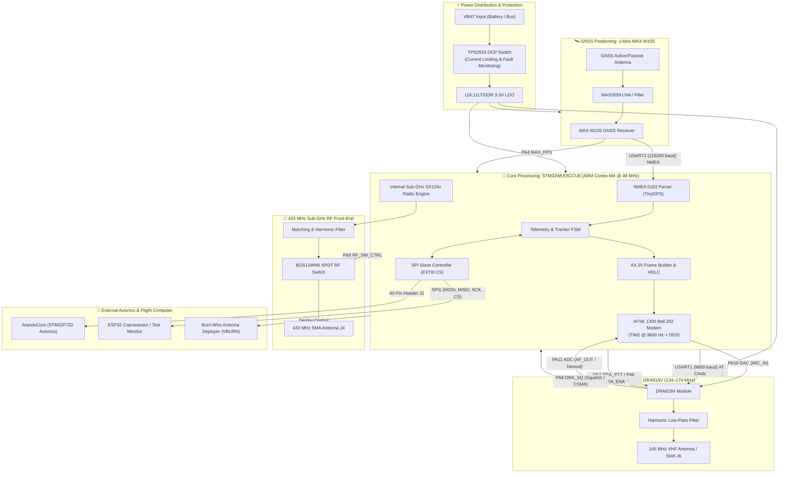
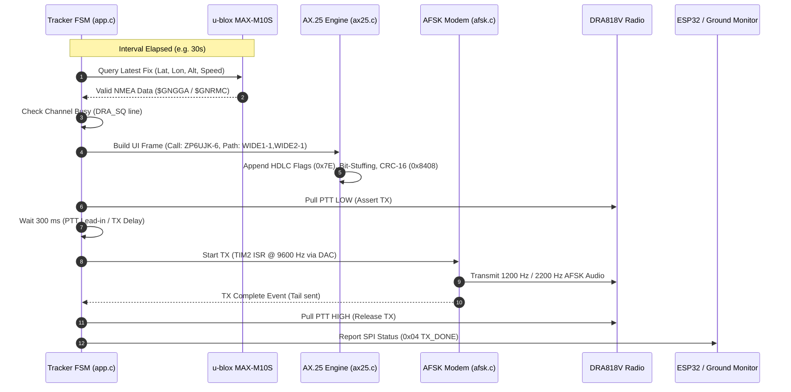

# CONTEXT.md — Comms_CCTE-2026

> **Sistema de Comunicación para el Cohete Suborbital URUTAU-III**  
> *Proyecto CCTE-2026 / Introducción a la Ingeniería Satelital*  
> *Desarrollado por: Sanie Peralta*

---

## 1. Executive Summary & Mission Overview

The **Comms_CCTE-2026** repository contains the complete hardware (schematics, PCB layouts, antenna designs) and embedded software (firmware, test suites, communication protocols) for the primary communication and telemetry payload (**Payload 1**) designed for the **URUTAU-III suborbital rocket**.

### Primary Objectives:
1. **APRS VHF Telemetry & Recovery Beacon (144–146 MHz / 145.000 MHz):**
   - Transmits periodic AX.25 UI frames containing GNSS coordinates, altitude, velocity, and telemetry packets using Bell 202 AFSK modulation (1200 baud, 1200 Hz / 2200 Hz).
   - Enables real-time ground tracking and payload recovery via amateur radio networks (APRS / Direwolf / aprs.fi).
   - Features full AX.25 demodulation, loopback validation, and standalone Digipeater capabilities.

2. **Sub-GHz High-Speed / Long-Range Data Link (433 MHz):**
   - Direct RF communication utilizing the internal Semtech SX126x transceiver embedded within the **STM32WLE5CCU6** SoC.
   - Configurable for LoRa and (G)FSK modulations with integrated RF switching (`BGS12WN6`) and high-efficiency matching networks.

3. **Avionics & Flight Computer Interface:**
   - Real-time telemetry routing to the main avionics flight computer (**AranduCore**, based on STM32F722) and secondary coprocessors (**ESP32**) via high-speed SPI and UART buses.

---

## 2. System Architecture & Block Diagram



---

## 3. Hardware Subsystems & Component Breakdown

### 3.1. Main Processing & Sub-GHz Radio: STM32WLE5CCU6
- **Architecture:** ARM Cortex-M4 32-bit RISC core operating at 48 MHz with 256 KB Flash and 64 KB SRAM.
- **RF Core:** Multi-modulation Sub-GHz radio based on Semtech SX126x (supports LoRa, (G)FSK, (G)MSK, BPSK).
- **Oscillator:** 32 MHz external HSE crystal (`ECS-320-8-37-CKM-TR3`).
- **Power Configuration:** Internal High-Efficiency DC-DC Step-Down (SMPS) converter enabled for ultra-low power operation (`VLXSMPS`, `VDDRF1V55`).
- **RF Switch:** Infineon `BGS12WN6E6329XTSA1` SPDT switch controlled via `PA9` to isolate TX and RX matching paths.

### 3.2. VHF FM Transceiver: Dorji DRA818V
- **Frequency Range:** 134 – 174 MHz (Configured for 145.0000 MHz amateur APRS frequency).
- **RF Power Output:** Selectable high/low (up to 1W / 30 dBm).
- **Modulation:** Analog FM voice/data with pre/de-emphasis bypass capability (`AT+SETFILTER=0,0,0`) for transparent AFSK modulation.
- **Control Interface:**
  - `USART1` (`PB6` TX, `PB7` RX @ 9600 baud) for AT configuration commands.
  - `PA7` (`DRA_PTT`): Active LOW Push-To-Talk control via digital NPN transistor `Q1` (`DTC144EET1G`).
  - `PA6` (`DRA_ENA`): Power-down / enable control line (Active HIGH).
  - `PA8` (`DRA_SQ`): Squelch detect output from radio (Active LOW when channel is busy).
  - `PA10` (`STM32_DAC_TO_DRA`): DAC Channel 1 audio injection into `MIC_IN`.
  - `PA11` (`DRA_TO_STM32_ADC`): Audio line output `AF_OUT` routed to ADC for software demodulation / loopback testing.

### 3.3. GNSS Receiver: u-blox MAX-M10S
- **Constellations:** Concurrent reception of GPS, GLONASS, Galileo, and BeiDou (M10 platform).
- **Interface:** `USART2` (`PA2` TX, `PA3` RX @ 115200 baud) parsing `$GNGGA` and `$GNRMC` NMEA sentences.
- **Precision Timing:** `MAX_PPS` (`PA4`) timepulse signal for millisecond-level time stamping and mission synchronization.
- **RF Front-End:** High-gain Maxim `MAX2659` low-noise amplifier (LNA) with integrated ESD and bias circuitry.

### 3.4. Power Protection & Regulation
- **Overcurrent Protection (OCP):** Texas Instruments `TPS2553QDBVRQ1` precision adjustable current-limiting power distribution switch (`R14 = 26.1 kΩ`, setting limit to ~1.0 A). Reports fault status via `OCP_NFAULT` (`PB8`).
- **Linear Voltage Regulator:** STMicroelectronics `LDL1117S33R` low-dropout 3.3V voltage regulator supplying clean power to MCU, DRA818V, and GPS.
- **ESD Protection:** Littelfuse `AQ3530-01FTG` and ST `ESDZL5-1F4` low-capacitance TVS diode arrays protecting RF ports and external lines.

### 3.5. Antenna & Deployment Module (`pcb_antennas`)
- **Baluns & RF Transformers:** Mini-Circuits `ADT1.5-122+` and `NCS1.5-232+` surface-mount wideband RF transformers (20–1200 MHz, 50Ω unbalanced to 75Ω balanced transformation).
- **Antenna Deployment:** Thermal burn-wire mechanism (`VBURN`) triggered via discrete switching transistor to release stowed antennas upon rocket fairing separation or apogee.

---

## 4. STM32 Pinout & Peripheral Mapping

| Pin | Peripheral / Function | Net Label / Connected Signal | Description |
|---|---|---|---|
| **PA0** | `EXTI0` / `SPI1_NSS` | `SPI1_CS` | SPI Chip Select (Active LOW, triggers slave EXTI interrupt) |
| **PA1** | `SPI1_SCK` | `SPI1_SCK` | SPI Clock from Master (ESP32 / AranduCore) |
| **PA2** | `USART2_TX` | `MAX_RXI_TO_STM32` | NMEA command transmission to GPS |
| **PA3** | `USART2_RX` | `MAX_TXO_TO_STM32` | NMEA sentence reception from GPS (115200 baud) |
| **PA4** | `GPIO_Input` | `MAX_PPS_TO_STM32` | 1 PPS Precision Timepulse from MAX-M10S |
| **PA5** | `SPI1_SCK` (alt) | `SPI1_SCK` | SPI Clock Line |
| **PA6** | `GPIO_Output` | `STM32_TO_DRA_ENA` | DRA818V Module Enable (High = Active, Low = Sleep) |
| **PA7** | `GPIO_Output` | `STM32_TO_DRA_PTT` | DRA818V PTT Line (Active LOW via transistor Q1) |
| **PA8** | `GPIO_Input` | `DRA_SQ_TO_STM32` | DRA818V Squelch Carrier Detect (Active LOW) |
| **PA9** | `GPIO_Output` | `RF_CRL_TO_STM32` | Sub-GHz RF Switch Control (`BGS12WN6`) |
| **PA10** | `DAC_OUT1` | `STM32_DAC_TO_DRA` | AFSK 1200/2200 Hz tone generator to DRA818 `MIC_IN` |
| **PA11** | `ADC_IN` | `DRA_TO_STM32_ADC` | Demodulator audio input from DRA818 `AF_OUT` |
| **PB3** | `SYS_JTDO_SWO` | `JTDO_SWO_TO_STM32` | Serial Wire Output (SWO Debug) |
| **PB4** | `SPI1_MISO` | `SPI1_MISO` | SPI Master-In-Slave-Out (Status & Frame dumping) |
| **PB5** | `SPI1_MOSI` | `SPI1_MOSI` | SPI Master-Out-Slave-In |
| **PB6** | `USART1_TX` | `DRA_RX_UART1_TX` | DRA818V AT Command TX (9600 baud) |
| **PB7** | `USART1_RX` | `DRA_TX_UART1_RX` | DRA818V AT Command RX (9600 baud) |
| **PB8** | `GPIO_Input` | `OCP_NFAULT` | Fault indicator from TPS2553 power switch |
| **PC13** | `GPIO_Output` | `LED_STATUS` | On-board status / debug LED indicator |
| **PA13** | `SYS_JTMS-SWDIO` | `JTMS_SWDIO_TO_STM32` | Serial Wire Data I/O |
| **PA14** | `SYS_JTCK-SWCLK` | `JTCK_SWCLK_TO_STM32` | Serial Wire Clock |

---

## 5. Software Architecture & Protocols

### 5.1. APRS / AX.25 / Bell 202 Modem Stack



#### Protocol Specifications:
- **Station Identification:**
  - Source Callsign: `ZP6UJK-6`
  - Destination: `APRS`
  - Path: `WIDE1-1, WIDE2-1`
- **Modulation Parameters:**
  - Mark Frequency: `1200 Hz`
  - Space Frequency: `2200 Hz`
  - Baud Rate: `1200 baud` (Bell 202 standard)
  - Sample Rate: `9600 Hz` (8 samples per bit, exact integer division from 48 MHz SYSCLK via `TIM2`)
  - Encoding: NRZI (Non-Return-to-Zero Inverted: '0' triggers a tone transition, '1' maintains tone)
- **Framing & Timing (VP-Digi Aligned):**
  - Frame Type: AX.25 Unnumbered Information (UI Frame: `Control = 0x03`, `PID = 0xF0`)
  - Frame Check Sequence: CRC-16 CCITT reflected (polynomial `0x8408`, initial value `0xFFFF`)
  - TX Delay (`txDelay`): `300 ms` (~45 preamble flag bytes `0x7E`)
  - TX Tail (`txTail`): `30 ms`
  - PTT Lead Time: `300 ms`

### 5.2. Inter-Processor SPI Protocol (STM32 Slave $\leftrightarrow$ ESP32 Master)
- **Bus Parameters:** SPI Mode 0 (CPOL=0, CPHA=0), MSB First, up to 500 kHz – 1 MHz.
- **Chip Select:** Driven by external master on `PA0` with EXTI interrupt handler.
- **Protocol Frames:**
  - **Single Byte Status:** Polled periodically by master (ESP32/AranduCore).
  - **Frame Dump Stream:** When a packet is decoded, STM32 sends `0x0A` (`SPI_STATUS_RX_FRAME`) followed immediately by length and raw AX.25 frame bytes.

#### Status Byte Definition Table:
| Code | Constant | Description |
|---|---|---|
| `0x00` | `SPI_STATUS_INIT` | System initializing / idle |
| `0x01` | `SPI_STATUS_HANDSHAKE_OK` | DRA818V AT handshake successful (`+DMOCONNECT:0`) |
| `0x02` | `SPI_STATUS_HANDSHAKE_ERR`| DRA818V communication failure / timeout |
| `0x03` | `SPI_STATUS_TX_ACTIVE` | RF transmission in progress (PTT active) |
| `0x04` | `SPI_STATUS_TX_DONE` | Packet transmission completed |
| `0x05` | `SPI_STATUS_GPS_FIX` | Valid 3D GNSS satellite fix acquired |
| `0x06` | `SPI_STATUS_GPS_WAIT` | Searching for GNSS satellites (cold start) |
| `0x07` | `SPI_STATUS_LOOPBACK_OK` | Internal DAC $\to$ ADC AFSK loopback test passed |
| `0x08` | `SPI_STATUS_LOOPBACK_ERR` | Loopback CRC or bit failure |
| `0x0A` | `SPI_STATUS_RX_FRAME` | Header indicating incoming decoded AX.25 frame dump |
| `0x0B` | `SPI_STATUS_DIGI_TX` | Digipeater re-transmitting received packet |
| `0x0C` | `SPI_STATUS_RX_IDLE` | Receiver listening on 145.000 MHz |
| `0x0D` | `SPI_STATUS_RX_SEEN` | Packet detected and currently being demodulated |

---

## 6. Repository Directory Structure

```
Comms_CCTE-2026/
├── Aplicattion_notes/               # Technical app notes and reference designs
│   ├── DRA818/                      # DRA818 VHF radio app notes & reference schematics
│   ├── GPS/                         # u-blox MAX-M10S integration manuals & SparkFun boards
│   ├── USB_UART_BRIDGE/             # ESP32-S3 USB-UART dev bridge notes
│   ├── WLE5/                        # ST Nucleo MB1720 / MB1791 reference schematics
│   ├── aprs-esp32/                  # ESP32 APRS reference designs & KiCad schematics
│   └── Understanding-APRS-Packets.pdf
├── Datasheets/                      # Core IC datasheets
│   ├── DRA818V.pdf                  # Dorji DRA818V VHF transceiver datasheet
│   ├── stm32wle4jb.pdf              # STM32WL series microcontroller datasheet
│   ├── esdzl5-1f4.pdf               # ESD protection TVS diode datasheet
│   └── GPS/
│       ├── MAX-M10S_DataSheet_UBX-20035208.pdf
│       └── MAX2659.pdf              # Maxim GNSS LNA datasheet
├── manuales/                        # Official design guidelines & ST Application Notes
│   ├── an5407-how-to-optimize-the-rf-board-layout-for-stm32wl5xex-mcus.pdf
│   ├── an5457-rf-matching-networks-optimized-for-stm32wl-series.pdf
│   ├── an5646-how-to-select-a-32-mhz-hse-oscillator-for-stm32wl.pdf
│   └── an5664-rssi-and-snr-for-lora-modulation-on-stm32wl.pdf
├── pcb_comms/                       # Main Comms Board (Payload 1) KiCad Project
│   ├── pcb_comms_board.kicad_pro    # KiCad project file
│   ├── pcb_comms_board.kicad_sch    # Top-level hierarchical schematic
│   ├── mcu.kicad_sch                # STM32WLE5 MCU & oscillator sheet
│   ├── aprs_radio.kicad_sch         # DRA818V VHF radio & audio conditioning
│   ├── gps.kicad_sch                # u-blox MAX-M10S GNSS module sheet
│   ├── rf.kicad_sch                 # Sub-GHz RF switch & matching networks
│   ├── ocp.kicad_sch                # TPS2553 overcurrent protection & power rails
│   ├── io_conn.kicad_sch            # 40-pin avionics interconnect & debug
│   ├── pcb_comms_board.kicad_pcb    # 4-layer PCB layout
│   └── bom/                         # Interactive HTML BOM (iBOM) & CSV parts lists
├── pcb_antennas/                    # Antenna deployer & RF balun KiCad project
│   ├── pcb_antennas.kicad_sch       # Balun transformers (ADT1.5-122+ / NCS1.5-232+)
│   ├── pcb_antennas.kicad_pcb       # PCB antenna geometry & deployment lines
│   └── manufacture_pcb_antennas/    # Fabrication gerbers and drill files
├── STM32Cube/                       # STM32CubeIDE Base Project for STM32WLE5
│   ├── STM32Cube.ioc                # STM32CubeMX hardware configuration
│   ├── Core/Src/                    # HAL drivers (GPIO, USART, SPI, I2C, ADC, DAC)
│   └── SubGHz_Phy/                  # SubGHz Middleware & SX126x radio driver
└── Software_tests/                  # Incremental firmware test suites
    ├── AranduCore/                  # STM32F722 Flight computer integration firmware
    ├── STM_TEST1_BLINK/             # GPIO output and system clock verification
    ├── STM32_test2_spi/             # SPI slave communications to ESP32 master
    ├── STM32_test3_gps/             # MAX-M10S NMEA parsing over USART2
    ├── STM32_test4_DRA/             # DRA818V AT commands & PTT handshake
    ├── Test7/                       # Periodic 500 Hz tone transmission test
    ├── Test8/                       # Full APRS Tracker TNC (AFSK TX + GPS + Direwolf OTA)
    ├── Test9/                       # Bidirectional APRS TNC & Digipeater (TX + RX Demod)
    ├── DRA818V_145MHZ_TEST/         # Dedicated VHF 145 MHz RF test fixtures
    └── STM32RADIO_433MHZ_TEST/      # Sub-GHz 433 MHz TX/RX test implementations
```

---

## 7. Firmware Test Matrix & Verification History

| Test Suite | Purpose | Key Peripherals Tested | Status / Validation Result |
|---|---|---|---|
| **`STM_TEST1_BLINK`** | Clock tree & GPIO bring-up | HSE 32 MHz, PLL 48 MHz, `PC13` LED | ✅ Passed |
| **`STM32_test2_spi`** | Inter-board SPI telemetry bus | `SPI1` Slave, `PA0` EXTI CS, ESP32 Master | ✅ Passed: Status bytes read reliably |
| **`STM32_test3_gps`** | GNSS fix acquisition & NMEA decoding | `USART2` (115200), TinyGPS library | ✅ Passed: Valid 3D coordinates parsed |
| **`STM32_test4_DRA`** | Radio AT command & PTT control | `USART1` (9600), `PA6` ENA, `PA7` PTT | ✅ Passed: Handshake `+DMOCONNECT:0` OK |
| **`Test7`** | Audio tone generation into VHF carrier | `PA10` DAC (500 Hz square), `PA7` PTT, SPI | ✅ Passed: Heard on ground SDR receiver |
| **`Test8`** | Full APRS AFSK 1200 GPS Tracker | `TIM2` @ 9600 Hz, DAC DDS, AX.25, NMEA | ✅ Passed: Decoded by Direwolf & aprs.fi |
| **`Test9`** | APRS TNC + Digipeater (TX & RX) | DAC TX, ADC `PA11` RX Demod, Digipeater FSM | ✅ Passed: Decodes frames & re-broadcasts |
| **`STM32RADIO_433MHZ`** | 433 MHz Sub-GHz RF Transceiver | `SubGHz_Phy`, SX126x core, `PA9` RF switch | ✅ Passed: LoRa/FSK packet exchange |

---

## 8. Operating Guidelines & Configuration Guide

### 8.1. Configuring APRS Parameters (`aprs_config.h`)
To customize the station callsign, radio frequency, or timing parameters, edit `Core/Inc/aprs_config.h`:

```c
/* Station Configuration */
#define APRS_MYCALL             "ZP6UJK"        // Pilot / Payload callsign
#define APRS_MYSSID             6               // SSID (-6 for special / satellite / rocket)
#define APRS_DESTCALL           "APRS"
#define APRS_PATH1CALL          "WIDE1"
#define APRS_PATH1SSID          1
#define APRS_PATH2CALL          "WIDE2"
#define APRS_PATH2SSID          1

/* Radio Frequency Configuration */
#define DRA818_TX_FREQ          "145.0000"      // VHF TX Frequency in MHz
#define DRA818_RX_FREQ          "145.0000"      // VHF RX Frequency in MHz
#define DRA818_SQUELCH          1               // Squelch level (1-8)
#define DRA818_BANDWIDTH        0               // 0 = 12.5 kHz (Narrow), 1 = 25 kHz (Wide)

/* AFSK Modem Calibration */
#define AFSK_DAC_MID            2048            // 12-bit DAC midpoint (3.3V / 2)
#define AFSK_DAC_AMP            300             // Audio amplitude (tune between 200-400 for 3 kHz deviation)
#define AX25_TX_DELAY_MS        300             // Preamble length (flags sent before frame)
#define AX25_TX_TAIL_MS         30              // Postamble tail length
#define APRS_BEACON_INTERVAL_MS 30000           // Beacon interval (30 seconds)
```

### 8.2. DRA818V Audio Calibration
1. Connect an SDR receiver (e.g. RTL-SDR running GQRX / SDR# / Direwolf) tuned to `145.000 MHz`.
2. Ensure `AT+SETFILTER=0,0,0` is issued during initialization to bypass internal high-pass/low-pass emphasis filters which distort Bell 202 tones.
3. Adjust `AFSK_DAC_AMP` until the FM frequency deviation measures approximately **$\pm 3.0 \text{ kHz}$ to $\pm 3.5 \text{ kHz}$** for clean Direwolf packet decoding without over-deviation clipping.

---

## 9. References & Technical Documentation
- **Microcontroller:** [STMicroelectronics STM32WLE5CC Datasheet & Reference Manual](https://www.st.com/en/microcontrollers-microprocessors/stm32wle5cc.html)
- **GNSS Module:** [u-blox MAX-M10S Integration Manual UBX-20053088](https://www.u-blox.com)
- **VHF Radio:** [Dorji DRA818V VHF Transceiver Module](file:///c:/Users/sanie/Documents/GitHub/Comms_CCTE-2026/Datasheets/DRA818V.pdf)
- **APRS Protocol Specification:** [APRS Protocol Reference v1.0.1 (Bob Bruninga, WB4APR)](file:///c:/Users/sanie/Documents/GitHub/Comms_CCTE-2026/Aplicattion_notes/Understanding-APRS-Packets.pdf)
- **Modem Implementation Reference:** [VP-Digi APRS Digipeater Firmware](file:///c:/Users/sanie/Documents/GitHub/Comms_CCTE-2026/Software_tests/Test9/References9/manual.md)
- **ST Application Notes:**
  - `AN5407`: Optimizing RF board layout for STM32WL series
  - `AN5457`: RF matching networks for STM32WL
  - `AN5646`: Selecting 32 MHz HSE crystal oscillators
  - `AN5664`: RSSI and SNR calculation for LoRa modulation
