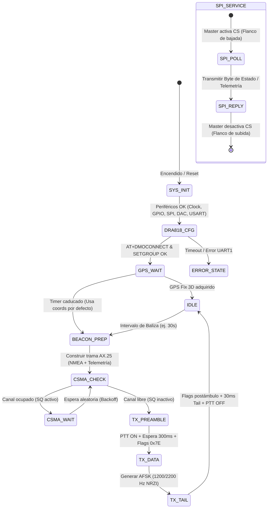

# Sistema de Comunicación para Cohete Suborbital URUTAU-III (Comms_CCTE-2026)
## Documentación Técnica del Proyecto Basado en STM32WLE5CCU6

---

## 1. Resumen Ejecutivo del Proyecto

El proyecto **Comms_CCTE-2026** (también denominado **Payload 1: APRS & Sub-GHz Comms**) es el módulo de comunicaciones y telemetría diseñado para el cohete suborbital experimental **URUTAU-III**, desarrollado en el marco de la cátedra de *Introducción a la Ingeniería Satelital (IIS)*.

El sistema integra un diseño de hardware de alta densidad y bajo consumo basado en el microcontrolador SoC **STM32WLE5CCU6**, el cual combina un núcleo ARM Cortex-M4 con un transceptor Sub-GHz interno, y lo complementa con un módulo de radiofrecuencia VHF analógico **Dorji DRA818V** para transmisión y recepción de tramas APRS (AX.25 sobre AFSK Bell 202 en 144–148 MHz) y un bus de interconexión SPI esclavo para comunicarse con la computadora de a bordo (OBC / ESP32).

```
+---------------------------------------------------------------------------------------------------+
|                                       PAYLOAD 1: COMMS BOARD                                      |
|                                                                                                   |
|  +--------------------+         UART (USART2)        +----------------------------------------+   |
|  |     GPS MODULE     | <==========================> |                                        |   |
|  | (JST-SH 6-pin J9)  |                              |                                        |   |
|  +--------------------+                              |                                        |   |
|                                                      |                                        |   |
|  +--------------------+    AFSK DAC Audio (PA10)     |            STM32WLE5CCU6               |   |
|  |                    | <--------------------------- |           (ARM Cortex-M4)              |   |
|  |      DRA818V       |       ADC Monitor (PA11)     |               @ 48 MHz                 |   |
|  |    VHF 145 MHz     | ---------------------------> |         256 KB Flash / 64 KB RAM       |   |
|  |   APRS / 1W PA     |      AT Commands (USART1)    |                                        |   |
|  |                    | <==========================> |     +----------------------------+     |   |
|  |                    |      PTT / ENA / SQ Lines    |     |  Integrated Sub-GHz Radio  |     |   |
|  |                    | <--------------------------- |     |   (SX126x Core - 433 MHz)  |     |   |
|  +--------------------+                              |     +----------------------------+     |   |
|            | (RF Ant J4)                             |                   |                    |   |
|            v                                         |                   | (RF Ctrl PA9)      |   |
|      VHF Low-Pass                                    +-------------------|--------------------+   |
|     Harmonic Filter                                                      |                        |
|            |                                                             v                        |
|            v                                                   BGS12WN6 RF Switch (IC4)           |
|      SMA Connector                                                       |                        |
|                                                                          v                        |
|                                                                    SMA Connector (J6)             |
|                                                                                                   |
|  +---------------------------------------------------------------------------------------------+  |
|  |                  SPI SLAVE (SCK: PA1, MISO: PB4, MOSI: PB5, CS/EXTI0: PA0)                  |  |
|  |                 40-Pin Header J2 (Stack Bus / OBC / ESP32 Communication)                    |  |
|  +---------------------------------------------------------------------------------------------+  |
|                                                                                                   |
|  +---------------------------------------------------------------------------------------------+  |
|  |  POWER & PROTECTION: TPS2553 OCP (IC2) + LDL1117S33R LDO (IC1) + Micro-USB (J7) / VBAT      |  |
|  +---------------------------------------------------------------------------------------------+  |
+---------------------------------------------------------------------------------------------------+
```

---

## 2. Arquitectura de Hardware y Componentes Principales

| Componente | Designador | Encapsulado / Tipo | Función Principal |
|---|---|---|---|
| **STM32WLE5CCU6** | `U2` | UFQFPN-48 (7x7 mm) | Microcontrolador principal (ARM Cortex-M4 @ 48 MHz) con módem Sub-GHz LoRa/FSK integrado. |
| **DRA818V** | `U3` | Módulo SMT 18 pines | Transceptor de radio VHF (134–174 MHz), salida RF hasta 1W (+30 dBm), para baliza APRS. |
| **ECS-320-8-37-CKM-TR3** | `Y3` | SMD 3.2x2.5 mm | Cristal de cuarzo de **32.000 MHz** para sincronismo del núcleo y sintetizador PLL RF. |
| **TPS2553QDBVRQ1** | `IC2` | SOT-23-6 | Interruptor de distribución de energía con limitación de corriente de precisión (OCP). |
| **LDL1117S33R** | `IC1` | SOT-223 | Regulador lineal LDO de bajo ruido (3.3V, hasta 1.2A) para alimentación digital y de radio. |
| **BGS12WN6E6329XTSA1** | `IC4` | TSNP-6 | Conmutador de RF SPDT de muy baja pérdida de inserción para conmutación TX/RX en 433 MHz. |
| **DTC144EET1G** | `Q1` | SOT-523 / SOT-23 | Transistor digital NPN con resistencias de polarización integradas (47k/47k) para control de PTT. |
| **AQ3530-01FTG** | `D3` | SOD-882 | Diodo supresor ESD de capacitancia ultrabaja (< 0.3 pF) para protección en líneas de RF. |
| **JST-SH 6-pin** | `J9` | Conector vertical 1.00mm | Conector de expansión para módulo GPS externo (MAX-M8Q / NEO-M8N). |
| **Header 2x20 (40 pines)** | `J2` | THT 2.54 mm Pitch | Conector de bus apilable (stack) para bus de alimentación, SPI esclavo, OCP y telemetría. |
| **Conectores SMA** | `J4`, `J6` | SMA Hembra Vertical | `J4`: Salida antena VHF 145 MHz (DRA818V); `J6`: Salida antena UHF 433 MHz (STM32WLE5). |
| **Micro-USB B** | `J7` | Molex 105164-0001 | Puerto USB para alimentación de banco y depuración / alimentación secundaria. |

---

## 3. Conexión e Integración Detallada del Radio DRA818V

El **Dorji DRA818V** es un módulo transceptor de voz/datos FM de alta integración. En este proyecto se utiliza como transmisor/receptor de **APRS (Automatic Packet Reporting System)** operando típicamente en **145.000 MHz** (o 144.390 / 144.800 MHz según la región).

### 3.1. Mapeo de Pines: DRA818V a STM32WLE5

```
+-----------------------------------------------------------------------------------------------+
|  DRA818V (U3) Pin   |  Función DRA818V  |  Señal Esquemático     | Pin STM32WLE5 | Modo GPIO / Periférico    |
+---------------------+-------------------+------------------------+---------------+---------------------------+
| Pin 1               | SQ (Squelch)      | DRA_SQ_TO_STM32        | PA8 (Pin 16)  | GPIO Input (Detección CSMA)|
| Pin 3               | AF_OUT (Audio)    | DRA_TO_STM32_ADC       | PA11 (Pin 34) | ADC1_IN15 (Demodulación)  |
| Pin 5               | PTT (Push-To-Talk)| STM32_TO_DRA_PTT       | PA7 (Pin 15)  | GPIO Output (vía Q1 NPN)  |
| Pin 6               | PD (Power Down)   | STM32_TO_DRA_ENA       | PA6 (Pin 14)  | GPIO Output (H: On / L: Off)|
| Pin 7               | H/L (Power Level) | H/L                    | VCC / Pull-Up | High = 1W / Low = 0.5W    |
| Pin 8               | VBAT (Aliment.)   | VBAT (filtrada)        | Fuente VBAT   | Alimentación (3.3V - 4.5V)|
| Pines 9, 10         | GND               | GND                    | GND           | Plano de masa común       |
| Pin 12              | ANT (RF 50 Ohm)   | DRA_ANT_FILT           | A filtro LPF  | Hacia filtro LC -> SMA J4 |
| Pin 16              | RXD (Comandos AT) | DRA_RX_UART1_TX        | PB6 (Pin 4)   | USART1_TX (9600 baud, 8N1)|
| Pin 17              | TXD (Respuestas)  | DRA_TX_UART1_RX        | PB7 (Pin 5)   | USART1_RX (9600 baud, 8N1)|
| Pin 18              | MIC_IN (Modulac.) | STM32_DAC_TO_DRA       | PA10 (Pin 33) | DAC1_OUT1 (Generador AFSK)|
+-----------------------------------------------------------------------------------------------+
```

### 3.2. Circuitos de Acondicionamiento del DRA818V

1. **Generación y Modulación de Audio AFSK (MIC_IN - Pin 18):**
   - El microcontrolador STM32WLE5 sintetiza digitalmente las frecuencias de modulación Bell 202 (**Mark: 1200 Hz**, **Space: 2200 Hz**) a 1200 baudios usando el **DAC interno de 12 bits (canal 1 en PA10)** cadenciado por el temporizador **TIM2 a 9600 Hz** (8 muestras por símbolo).
   - La señal de salida del DAC pasa por una red de filtrado pasivo paso-bajo y desacoplo DC compuesta por `R7` (10 kΩ), `R8` (10 kΩ), `C20` (1 µF) y `C37` (220 nF), asegurando que el nivel de audio no sature el modulador FM del DRA818V y evite distorsión armónica fuera de banda.

2. **Recepción y Monitoreo de Audio (AF_OUT - Pin 3):**
   - La salida de audio demodulada del DRA818V se acopla en AC a través de `C41` (220 nF) hacia el pin **PA11 (ADC1)** del STM32WLE5. Esto permite implementar verificación por lazo cerrado (loopback test) y decodificación de paquetes entrantes.

3. **Control de Transmisión (PTT - Pin 5):**
   - El pin PTT del DRA818V es activo en nivel **BAJO (GND)**.
   - El STM32WLE5 controla el transistor digital NPN **Q1 (`DTC144EET1G`)** desde **PA7**.
   - Al poner **PA7 en ALTO**, `Q1` conduce y drena el pin PTT a masa, activando la etapa de potencia RF de 1W. Al iniciar el firmware, PA7 se inicializa en BAJO para evitar emisiones espurias.

4. **Habilitación y Ahorro de Energía (PD - Pin 6):**
   - Controlado por **PA6**. Poner PA6 en nivel ALTO enciende el módulo; ponerlo en nivel BAJO apaga los osciladores internos reduciendo el consumo a menos de 1 µA.

5. **Detección de Portadora / Canal Ocupado (SQ - Pin 1):**
   - Conectado a **PA8**. Permite al algoritmo del módem implementar **CSMA/CD (Carrier Sense Multiple Access)**: si SQ detecta portadora activa, la baliza APRS retrasa su transmisión para evitar colisiones en la frecuencia compartida.

6. **Filtrado Armónico de RF (ANT - Pin 12):**
   - La salida de antena del módulo se conecta a un filtro paso-bajo elíptico/Chebyshev de 7 polos formado por los inductores `L11` (56 nH), `L12` (68 nH), `L13` (56 nH) y capacitores `C38` (20 pF), `C50` (36 pF), `C51` (36 pF), `C52` (20 pF) con salida al conector **SMA J4**, garantizando atenuación >40 dB en los armónicos de 290 MHz y 435 MHz según normativa ITU/IARU.

7. **Configuración por Comandos AT (USART1 @ 9600 baud):**
   - Handshake inicial: `AT+DMOCONNECT` $\rightarrow$ respuesta: `+DMOCONNECT:0`
   - Configuración de grupo: `AT+DMOSETGROUP=0,145.0000,145.0000,0000,1,0000` (ancho de banda 12.5 kHz, frecuencias TX/RX, subtono deshabilitado, squelch nivel 1).
   - Desactivación de pre-énfasis / filtros de voz para respuesta plana AFSK: `AT+SETFILTER=0,0,0`
   - Ajuste de volumen: `AT+DMOSETVOLUME=5`

---

## 4. Interfaz de Comunicación SPI (SPI1 Slave)

El sistema implementa la interfaz **SPI1 en modo Esclavo (Slave)** en el STM32WLE5 para comunicarse bidireccionalmente con la Computadora de A Bordo principal (OBC) o módulo de enlace externo (ESP32 / MCU de misión) a través del conector apilable **J2**.

### 4.1. Asignación de Pines del Bus SPI1

```
+-----------------------------------------------------------------------------------------------+
|  Señal SPI1    | Pin STM32WLE5 | Función en el SoC            | Pin Header J2 | Descripción            |
+----------------+---------------+------------------------------+---------------+------------------------+
| SPI1_SCK       | PA1 (Pin 8)   | SPI1_SCK (Entrada de Reloj)  | J2 (Pin 34)   | Reloj generado por Master|
| SPI1_MISO      | PB4 (Pin 2)   | SPI1_MISO (Salida Esclavo)   | J2 (Pin 31)   | Datos hacia el Master  |
| SPI1_MOSI      | PB5 (Pin 3)   | SPI1_MOSI (Entrada Esclavo)  | J2 (Pin 32)   | Comandos del Master    |
| SPI1_CS        | PA0 (Pin 7)   | GPIO Input con EXTI0 (CS)    | J2 (Pin 33)   | Chip Select Activo Bajo|
+-----------------------------------------------------------------------------------------------+
```

### 4.2. Protocolo y Sincronización SPI

- **Parámetros del Bus:**
  - Modo: SPI Slave Full-Duplex
  - Formato de datos: 8 bits, MSB First
  - Polaridad y Fase (Clock Mode): CPOL = 0 (Low), CPHA = 0 (1st Edge)
  - Velocidad máxima de reloj: Hasta 12 MHz (sincronizado con HCLK a 48 MHz)

- **Mecanismo de Interrupción por Chip Select (PA0 EXTI0):**
  - El pin `PA0` (`SPI1_CS`) está configurado como entrada con interrupción por flanco de subida y bajada (`GPIO_MODE_IT_RISING_FALLING`).
  - **Flanco de Bajada (CS $\downarrow$):** La línea `CS` pasa a nivel bajo cuando el Master inicia la transferencia. La rutina `HAL_GPIO_EXTI_Callback` rearma el buffer de transmisión/recepción de `SPI1` con `HAL_SPI_TransmitReceive_IT` para precargar el byte de estado actual.
  - **Flanco de Subida (CS $\uparrow$):** Indica el fin de la trama de lectura/escritura; el STM32 procesa el comando recibido y actualiza los registros de telemetría.

- **Codificación de Estados del Sistema sobre SPI:**
  | Byte de Estado (Hex) | Macro en Código | Significado |
  |---|---|---|
  | `0x00` | `SPI_STATUS_INIT` | Inicialización de periféricos en curso. |
  | `0x01` | `SPI_STATUS_HANDSHAKE_OK` | Enlace y configuración con radio DRA818V exitosos. |
  | `0x02` | `SPI_STATUS_HANDSHAKE_ERR` | Error de comunicación UART con DRA818V. |
  | `0x03` | `SPI_STATUS_TX_ACTIVE` | Transmisión de baliza APRS / Sub-GHz en progreso (PTT activo). |
  | `0x04` | `SPI_STATUS_TX_DONE` | Transmisión completada; radio en reposo. |
  | `0x05` | `SPI_STATUS_GPS_WAIT` | Módulo GPS buscando satélites (sin posición válida). |
  | `0x06` | `SPI_STATUS_GPS_FIX` | Posición GPS 3D fijada y lista para tramas de telemetría. |

---

## 5. Transceptor Integrado Sub-GHz (LoRa / GFSK en 433 MHz)

Además del radio VHF DRA818V, la placa aprovecha el núcleo RF interno del **STM32WLE5CCU6**:

- **Frecuencia de Operación:** 433.000 MHz (Banda ISM / Radioaficionados UHF).
- **Modulaciones Soportadas:** LoRa (BW 7.8 kHz a 500 kHz, SF5 a SF12) y (G)FSK / (G)MSK (hasta 300 kbps).
- **Potencia de Salida:** Salida de alta potencia `RFO_HP` (hasta +22 dBm / 160 mW).
- **Conmutación RF:** Conmutador `BGS12WN6` controlado por **PA9 (`RF_CRL_TO_STM32`)**:
  - `PA9 = LOW`: Modo RX / Reposo (antena conectada a `RFI_P` / `RFI_N`).
  - `PA9 = HIGH`: Modo TX (antena conectada a `RFO_HP` a través del filtro pasa-bajos de 433 MHz).
- **Salida de Antena:** Conector **SMA J6**.

---

## 6. Subsistema de Navegación GPS (USART2)

- **Conector de Interfaz:** `J9` (JST-SH 6 pines: VCC, GND, TX, RX, PPS, INT).
- **Conexión al STM32WLE5:**
  - `UART2_TX` en **PA2** (USART2 TX hacia RX del GPS).
  - `UART_RX` en **PA3** (USART2 RX desde TX del GPS @ 115200 baud).
- **Parser NMEA:** Implementado con librería `TinyGPS` en modo interrupción por byte con buffer circular y recuperación de sobreescritura (ORE), extrayendo latitud, longitud, altitud sobre el nivel del mar, velocidad y tiempo UTC para el ensamblado de las tramas APRS (`!DDMM.MMN/DDDMM.MME-`).

---

## 7. Subsistema de Alimentación y Protección (OCP)

```
                       +-------------------+
  VBAT_IN (J2) ------->|                   |
                       |  TPS2553QDBVRQ1   |-----> VBAT (Filtrada a DRA818V PA)
  VBUS (+5V USB J7) -->|   (OCP Switch)    |
                       |                   |-----> LDL1117S33R (LDO 3.3V) ----> +3V3 (MCU, Logic, GPS)
                       +-------------------+
                             |       ^
            OCP_NFAULT (PC13)|       | OCP_EN (J2 / MCU)
```

1. **Protección Contra Sobrecorriente (OCP):**
   - El integrado **TPS2553QDBVRQ1 (`IC2`)** protege las líneas de alimentación frente a cortocircuitos o bloqueos por radiación (latch-up).
   - Límite de corriente ajustable configurado por `R14` (26.1 kΩ).
   - Señal `OCP_EN`: Habilita la etapa de potencia desde el bus general.
   - Señal `OCP_NFAULT`: Salida de drenador abierto conectada a **PC13** del STM32WLE5 para generar interrupciones de falla por sobrecorriente.
2. **Regulador LDO de 3.3V:**
   - El **LDL1117S33R (`IC1`)** genera la línea de **+3V3** estabilizada para el núcleo digital, oscilador TCXO/cristal y módulo GPS, con desacoplos mediante `C8` (10 µF), `C39` (10 µF) y `C48` (4.7 µF).

---

## 8. Mapeo Completo de Pines del STM32WLE5CCU6 (UFQFPN-48)

| Pin | Nombre del Pin | Conexión en el Proyecto | Descripción Funcional |
|---|---|---|---|
| 1 | PB3 | `JTDO_SWO_TO_STM32` | Depuración SWD (Trace SWO) |
| 2 | PB4 | `SPI1_MISO` | Bus SPI1 - Master In Slave Out (hacia J2) |
| 3 | PB5 | `SPI1_MOSI` | Bus SPI1 - Master Out Slave In (desde J2) |
| 4 | PB6 | `DRA_RX_UART1_TX` | USART1 TX - Control AT hacia DRA818V RXD |
| 5 | PB7 | `DRA_TX_UART1_RX` | USART1 RX - Respuestas AT desde DRA818V TXD |
| 6 | PB8 | NC | No conectado |
| 7 | PA0 | `SPI1_CS` | Entrada Chip Select SPI1 con interrupción EXTI0 |
| 8 | PA1 | `SPI1_SCK` | Reloj de bus SPI1 (desde J2) |
| 9 | PA2 | `UART2_TX` | USART2 TX - Hacia entrada GPS |
| 10 | PA3 | `UART_RX` | USART2 RX - Recepción NMEA desde GPS |
| 11 | VDD | `+3V3` | Alimentación digital MCU |
| 12 | PA4 | NC | No conectado |
| 13 | PA5 | NC | No conectado |
| 14 | PA6 | `STM32_TO_DRA_ENA` | Habilitación (PD) del DRA818V (Alto = Activo) |
| 15 | PA7 | `STM32_TO_DRA_PTT` | Control de PTT del DRA818V (vía transistor Q1) |
| 16 | PA8 | `DRA_SQ_TO_STM32` | Lectura de Squelch del DRA818V (Detección portadora) |
| 17 | PA9 | `RF_CRL_TO_STM32` | Control de conmutador RF BGS12WN6 (433 MHz TX/RX) |
| 18 | NRST | `STM32_NRST` | Línea de Reset del Microcontrolador |
| 19 | PH3-BOOT0 | Switch `S1` / Pulldown | Selección de modo de arranque (Bootloader / Flash) |
| 20 | RFI_P | Red de acople RF 433 MHz | Entrada positiva diferencial Sub-GHz RF RX |
| 21 | RFI_N | Red de acople RF 433 MHz | Entrada negativa diferencial Sub-GHz RF RX |
| 22 | RFO_LP | NC | Salida Low-Power Sub-GHz (no utilizada) |
| 23 | RFO_HP | Red de acople RF 433 MHz | Salida High-Power Sub-GHz RF TX (+22 dBm) |
| 24 | VR_PA | Filtro de alimentación PA | Regulador de tensión interno de la etapa de potencia RF |
| 25 | VDDPA | Filtro `VDDPA` | Alimentación de la etapa de potencia RF |
| 26 | OSC_IN | Cristal `Y3` (Pin 1) | Entrada del oscilador de 32.000 MHz |
| 27 | OSC_OUT | Cristal `Y3` (Pin 3) | Salida del oscilador de 32.000 MHz |
| 28 | VDDRF | `+3V3` filtrado | Alimentación de la sección de radio interna |
| 29 | VDDRF1V55 | `VDDRF1V55` | Salida regulada a 1.55V para la radio Sub-GHz |
| 30 | PB0 | NC | Línea de alimentación TCXO (no utilizada) |
| 31 | PB2 | NC | No conectado |
| 32 | PB12 | NC | No conectado |
| 33 | PA10 | `STM32_DAC_TO_DRA` | Salida DAC1 canal 1 (Tono AFSK 1200/2200 Hz) |
| 34 | PA11 | `DRA_TO_STM32_ADC` | Entrada ADC1 canal 15 (Audio RX desde DRA818V) |
| 35 | PA12 | NC | No conectado |
| 36 | PA13 | `JTMS_SWDIO_TO_STM32`| Depuración SWD (Data I/O) |
| 37 | VBAT | `+3V3` | Alimentación de respaldo RTC |
| 38 | PC13 | `OCP_NFAULT` | Entrada de interrupción de falla por sobrecorriente |
| 39 | PC14 | NC (OSC32_IN) | Oscilador LSE de 32.768 kHz (opcional) |
| 40 | PC15 | NC (OSC32_OUT) | Oscilador LSE de 32.768 kHz (opcional) |
| 41 | VDDA | `+3V3` filtrado | Alimentación analógica para ADC/DAC |
| 42 | PA14 | `JTCK_SWCLK_TO_STM32`| Depuración SWD (Clock) |
| 43 | PA15 | NC | No conectado |
| 44 | VDD | `+3V3` | Alimentación digital MCU |
| 45 | VFBSMPS | `VLXSMPS` (vía `L2` 15uH)| Realimentación del convertidor Buck SMPS interno |
| 46 | VDDSMPS | `+3V3` | Alimentación del convertidor Buck SMPS interno |
| 47 | VLXSMPS | Inductor `L2` (15 µH) | Salida conmutada del convertidor Buck SMPS interno |
| 48 | VSSSMPS | GND | Masa del convertidor SMPS |
| 49 | EPAD / GND | GND (Plano térmico) | Pad térmico y plano de referencia de masa principal |

---

## 9. Flujo Operativo y Máquina de Estados del Firmware



---

## 10. Conclusiones y Recomendaciones de Integración

1. **Sintonía de Niveles de Audio:**
   - La amplitud generada por el DAC del STM32WLE5 hacia el pin `MIC_IN` del DRA818V debe ajustarse por software (`AFSK_DAC_AMP` entre 200 y 400 LSB) para evitar sobremodulación y splatter en el espectro VHF.
2. **Configuración del DRA818V:**
   - Es mandatorio enviar el comando `AT+SETFILTER=0,0,0` tras el encendido para desactivar los filtros de énfasis y de-énfasis de voz del módulo comercial, permitiendo que los tonos de 1200 Hz y 2200 Hz tengan una respuesta en frecuencia plana y simétrica.
3. **Manejo del Bus SPI:**
   - El firmware del Master (ESP32 / OBC) debe respetar los tiempos de guarda entre transacciones SPI, permitiendo que la interrupción `EXTI0` en `PA0` prepare el buffer de respuesta antes de iniciar los pulsos de reloj en `PA1` (`SPI1_SCK`).
4. **Disipación Térmica y RF:**
   - Al transmitir a 1W en VHF, el módulo DRA818V y el pad térmico del STM32WLE5 transfieren calor a los planos de tierra internos del PCB. Se recomienda mantener períodos de transmisión cortos (ciclos de trabajo de balizas de ~1 segundo cada 15 a 30 segundos).
