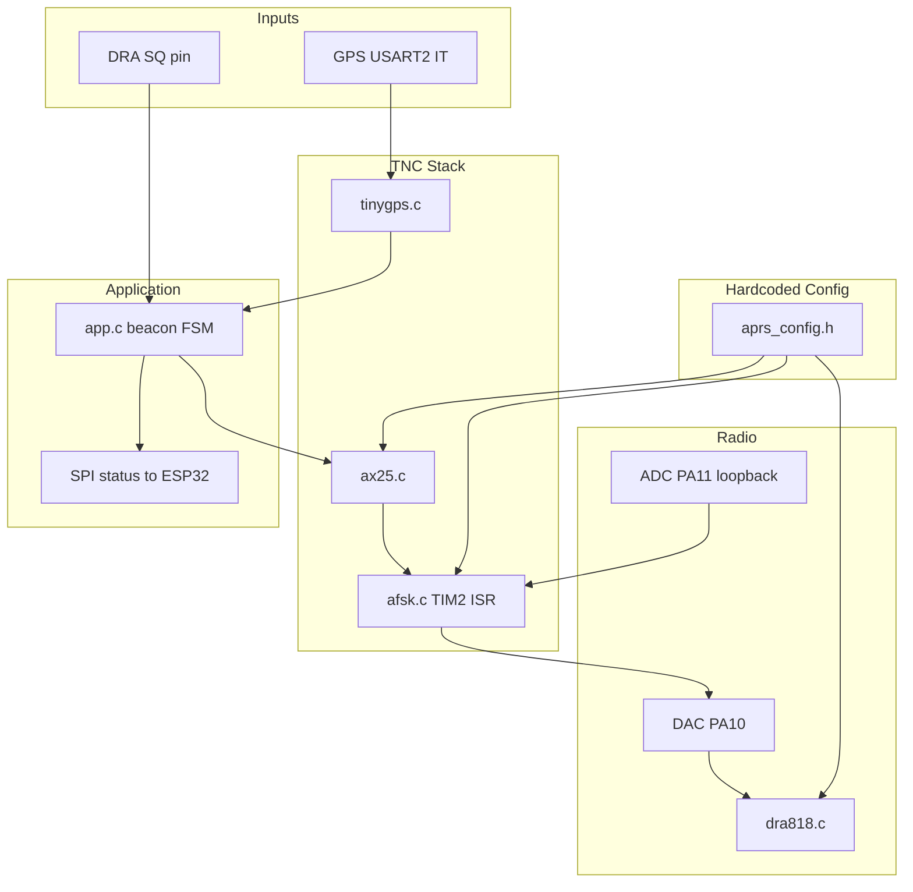

# APRS Tracker TNC — Test8 Implementation Plan

## Context

[`STM32_test8_DRA_TX_GPS`](c:\Users\sanie\Documents\GitHub\Comms_CCTE-2026\Software_tests\Test8\STM32_test8_DRA_TX_GPS) is a **bare CubeMX scaffold** (peripherals init, empty `while(1)`). All application logic must be added.

The hardware target is already correct in the `.ioc`:

| Peripheral | Pin / role |
|---|---|
| USART1 @ 9600 | DRA818V AT + module UART |
| USART2 @ 115200 | GPS NMEA |
| PA10 DAC | AFSK audio → DRA818V |
| PA11 ADC | Demod monitor / loopback |
| PA6 ENA, PA7 PTT, PA8 SQ | Radio control |
| TIM2 @ 9600 Hz | AFSK sample clock (PSC=0, ARR=4999 @ 48 MHz) |
| SPI1 slave | ESP32 status byte (same pattern as test3/test7) |

**Reference sources to reuse (not copy blindly):**

- [`References/STM32_test7_DRA_TX`](c:\Users\sanie\Documents\GitHub\Comms_CCTE-2026\Software_tests\Test8\References\STM32_test7_DRA_TX) — proven DRA818 handshake, PTT polarity, conservative DAC drive (±100 LSB)
- [`References/STM32_test3_gps`](c:\Users\sanie\Documents\GitHub\Comms_CCTE-2026\Software_tests\Test8\References\STM32_test3_gps) — TinyGPS + USART2 IT @ 115200
- [`References/STM32_test8.0_DRA_TX_GPS`](c:\Users\sanie\Documents\GitHub\Comms_CCTE-2026\Software_tests\Test8\References\STM32_test8.0_DRA_TX_GPS) — full stack skeleton (AFSK, AX.25, app FSM) — **reuse structure, fix decode issues**
- [`References/vp-digi-v.2.0.1`](c:\Users\sanie\Documents\GitHub\Comms_CCTE-2026\Software_tests\Test8\References\vp-digi-v.2.0.1) — behavioral reference for modem timing, NRZI, and AX.25 TX stages (no USB/KISS/digipeater needed)

## Why test8.0 failed Direwolf (SDR saw RF)

Two high-probability gaps vs VP-Digi defaults in [`vp-digi main.c`](c:\Users\sanie\Documents\GitHub\Comms_CCTE-2026\Software_tests\Test8\References\vp-digi-v.2.0.1\Core\Src\main.c):

```219:221:c:\Users\sanie\Documents\GitHub\Comms_CCTE-2026\Software_tests\Test8\References\vp-digi-v.2.0.1\Core\Src\main.c
	Ax25Config.quietTime = 300;
	Ax25Config.txDelayLength = 300;
	Ax25Config.txTailLength = 30;
```

| Issue | test8.0 | Fix for test8 |
|---|---|---|
| **DAC amplitude** | `AFSK_DAC_AMP = 2000` (~full scale) | Start **200–400** (test7 used ±100); tune with SDR |
| **TX delay** | 20 flags only, PTT lead 150 ms | Add **300 ms txDelay** (~45 × 0x7E) **before** header flags; PTT lead ≥ 300 ms |
| **TX tail** | PTT drops 100 ms after last bit | Add **30 ms tail** (mark/0x7E bytes) after postamble, then PTT off |
| **Validation** | OTA only | **DAC→ADC loopback** on PA10→PA11 before OTA |

The Bell 202 core in test8.0 (9600 Hz, 8 sps, 1200/2200 Hz, NRZI) is mathematically correct and can be kept.

## Target architecture



## File layout to add under `Core/`

| New file | Source / basis |
|---|---|
| [`Core/Inc/aprs_config.h`](c:\Users\sanie\Documents\GitHub\Comms_CCTE-2026\Software_tests\Test8\STM32_test8_DRA_TX_GPS\Core\Inc\aprs_config.h) | New — all hardcoded params (callsign, 145 MHz, modem, timing) |
| `Core/Src/dra818.c`, `dra818.h` | Port from test8.0 (includes `AT+SETFILTER=0,0,0` for flat audio) |
| `Core/Src/tinygps.c`, `tinygps.h` | Copy from test3 |
| `Core/Src/afsk.c`, `afsk.h` | Port from test8.0; add txDelay/tail mark-tone stages |
| `Core/Src/ax25.c`, `ax25.h` | Port from test8.0; extend preamble/tail to match VP-Digi stages |
| `Core/Src/app.c`, `app.h` | Port from test8.0; add compile-time test modes for bring-up |
| `Core/Inc/app_test_modes.h` | New — `#define APP_TEST_MODE` enum for phased validation |

Wire into [`main.c`](c:\Users\sanie\Documents\GitHub\Comms_CCTE-2026\Software_tests\Test8\STM32_test8_DRA_TX_GPS\Core\Src\main.c):

```c
App_Init();
while (1) { App_Run(); }
```

Add ISRs in [`stm32wlxx_it.c`](c:\Users\sanie\Documents\GitHub\Comms_CCTE-2026\Software_tests\Test8\STM32_test8_DRA_TX_GPS\Core\Src\stm32wlxx_it.c): `USART2_IRQHandler`, `EXTI0_IRQHandler` (SPI CS), and `HAL_TIM_PeriodElapsedCallback` → `AFSK_TimerTick()`.

Register all new `.c` files in the CubeIDE `.cproject`.

## Hardcoded configuration (`aprs_config.h`)

Single edit-before-build header (no USB, no runtime menu):

```c
/* Station */
#define APRS_MYCALL         "ZP6UJK"
#define APRS_MYSSID         6          
#define APRS_DESTCALL       "APRS"
#define APRS_PATH1CALL      "WIDE1"    #define APRS_PATH1SSID 1
#define APRS_PATH2CALL      "WIDE2"    #define APRS_PATH2SSID 1

/* Radio */
#define DRA818_TX_FREQ      "145.0000"
#define DRA818_RX_FREQ      "145.0000"
#define DRA818_SQUELCH      1
#define DRA818_BANDWIDTH    0          /* 12.5 kHz */

/* Modem — VP-Digi aligned */
#define AFSK_SAMPLE_RATE    9600
#define AFSK_BAUD_RATE      1200
#define AFSK_MARK_HZ        1200
#define AFSK_SPACE_HZ       2200
#define AFSK_DAC_MID        2048
#define AFSK_DAC_AMP        300        /* tune: 200→400 */

/* Timing — match VP-Digi defaults */
#define AX25_TX_DELAY_MS    300
#define AX25_TX_TAIL_MS     30
#define AX25_HEADER_FLAGS   4
#define AX25_FOOTER_FLAGS   8
#define DRA818_PTT_ON_DELAY_MS   300
#define DRA818_PTT_OFF_DELAY_MS  50     /* after tail */
#define APRS_BEACON_INTERVAL_MS  30000
```

## Step-by-step bring-up (compile-time test modes)

Use `APP_TEST_MODE` in `app_test_modes.h` to gate behavior. **Only one mode active per build.** Advance only after the current gate passes.

### Phase 0 — Project skeleton
- Add all source files and `App_Init`/`App_Run` wiring
- NVIC priorities: TIM2 (0), SPI1 (1), USART2 (2), EXTI0 (3) — same as test8.0
- SPI status bytes: reuse test7/test3 codes (`HANDSHAKE_OK`, `GPS_FIX`, `TX_ACTIVE`, etc.)

**Gate:** Builds cleanly; ESP32 reads handshake status byte.

### Phase 1 — DRA818 radio (`APP_TEST_DRA818_ONLY`)
Port [`dra818.c`](c:\Users\sanie\Documents\GitHub\Comms_CCTE-2026\Software_tests\Test8\References\STM32_test8.0_DRA_TX_GPS\Core\Src\dra818.c):
1. ENA HIGH + 1 s boot
2. Reconfigure USART1 to 9600
3. `AT+DMOCONNECT` → verify `+DMOCONNECT:0`
4. `AT+DMOSETGROUP=0,145.0000,145.0000,0000,1,0000`
5. `AT+SETFILTER=0,0,0` (bypass emphasis/filter — critical for AFSK)
6. `AT+DMOSETVOLUME=5`

**Gate:** Handshake OK on SPI; SDR hears carrier when PTT keyed manually (optional).

### Phase 2 — Pure tone modem (`APP_TEST_TONE_1200`)
Before AX.25, validate TIM2 + DAC path (test7 proved analog chain, but at 500 Hz square wave):
- TIM2 ISR outputs **1200 Hz sine** via DDS (same table as AFSK)
- PTT on → 3 s tone → PTT off, every 15 s
- `AFSK_DAC_AMP` = 300

**Gate:** SDR waterfall shows clean **1200 Hz** at 145 MHz; no clipping/splatter.

### Phase 3 — Alternating cal tones (`APP_TEST_CAL_ALT`)
Transmit alternating 1200/2200 Hz (VP-Digi `cal alt` equivalent), 500 ms each, 10 cycles.

**Gate:** SDR shows **equal amplitude** on both tones; deviation looks symmetric.

### Phase 4 — AX.25 loopback (`APP_TEST_AX25_LOOPBACK`)
- Build fixed-position frame: `!0000.00N/00000.00E-TEST8`
- TX via DAC; **simultaneously RX via ADC** on PA11 (wire jumper PA10→PA11 on bench)
- `AX25_RxBit()` → frame callback fires with valid CRC

**Gate:** Loopback decodes own frame (CRC OK, info field matches). Fix AX.25/bit-stuffing here before OTA.

### Phase 5 — OTA minimal beacon (`APP_TEST_AX25_OTA`)
Same fixed-position frame, over the air:
- Full VP-Digi timing: 300 ms txDelay + 4 header flags + frame + 8 footer flags + 30 ms tail
- PTT lead 300 ms

**Gate:** **Direwolf decodes** frame (`decode_aprs` or `aprs.fi`). Tune `AFSK_DAC_AMP` if needed.

### Phase 6 — GPS integration (`APP_TEST_GPS`)
Port [`tinygps.c`](c:\Users\sanie\Documents\GitHub\Comms_CCTE-2026\Software_tests\Test8\References\STM32_test3_gps\Core\Src\tinygps.c) + USART2 IT pattern:
- Byte-at-a-time RX with ORE clear + error recovery
- SPI status: `GPS_WAIT` / `GPS_FIX`
- Format position: `!DDMM.MMN/DDDMM.MME` via `buildGpsBeaconInfo()` from test8.0

**Gate:** Outdoor/antenna GPS fix; SPI shows fix; beacon info string updates.

### Phase 7 — Full APRS tracker (`APP_TEST_APRS_TRACKER`)
Combine all subsystems in the beacon FSM from test8.0:

```
IDLE → (interval elapsed + handshake OK) → CHECK_CHANNEL (SQ clear, max 5 s)
  → build GPS/APRS info → PTT ON → wait 300 ms
  → AFSK TX (delay + flags + frame + tail) → PTT OFF → IDLE
```

**Gate:** Direwolf decodes live GPS position beacons every 30 s; aprs.fi shows tracker.

## AX.25 / AFSK alignment with VP-Digi

Keep test8.0's proven pieces:
- NRZI: bit 0 → toggle tone, bit 1 → hold tone
- CRC-16 CCITT reflected (poly 0x8408)
- Address encoding with C-bit on destination, extension bit on last address
- UI frame: ctrl **0x03**, PID **0xF0**

**Change TX bit-stream assembly** in `ax25.c` to match VP-Digi stages ([`ax25.c` TX stages](c:\Users\sanie\Documents\GitHub\Comms_CCTE-2026\Software_tests\Test8\References\vp-digi-v.2.0.1\Core\Src\ax25.c)):

1. **PREAMBLE** — `txDelay` bytes of 0x7E (computed: `TX_DELAY_MS * 1200 / 8000`)
2. **HEADER_FLAGS** — 4 × 0x7E
3. **DATA** — addresses + ctrl + pid + info + FCS (bit-stuffed)
4. **FOOTER_FLAGS** — 8 × 0x7E
5. **TAIL** — `txTail` bytes of 0x7E (mark tone hold for decoder)

Do **not** port from VP-Digi: USB CDC, KISS, digipeater, flash config, FX.25, pre/de-emphasis BPF (add later only if decode remains marginal).

## Differences from VP-Digi (accepted)

| VP-Digi | Test8 WLE5 |
|---|---|
| USB config terminal | All params in `aprs_config.h` |
| PWM + RC filter DAC | Native 12-bit DAC on PA10 |
| 72 MHz F103 | 48 MHz WLE5 — keep 9600 Hz / 8 sps (exact integer) |
| Dual demod + PLL | Simplified correlator OK for loopback; no RX needed for tracker MVP |

## Test / validation checklist

- [ ] Loopback: own AX.25 frame CRC-valid on bench (PA10→PA11 jumper)
- [ ] SDR: 1200 and 2200 Hz tones equal amplitude, no clipping
- [ ] Direwolf: decodes fixed-position beacon at 145.000 MHz
- [ ] Direwolf: decodes GPS position after fix acquired
- [ ] CSMA: beacon skipped when SQ indicates busy channel
- [ ] SPI: ESP32 sees correct status through full cycle

## Risk notes

- **Legal:** Replace placeholder callsign in `aprs_config.h` before transmitting
- **Audio level:** Most likely root cause of test8.0 failure — treat amplitude as the primary tuning knob
- **DRA818 filter:** Must send `AT+SETFILTER=0,0,0` or 2200 Hz space tone will be attenuated
- **PTT transistor:** HIGH = TX (confirmed in test7 comments) — do not invert in software
